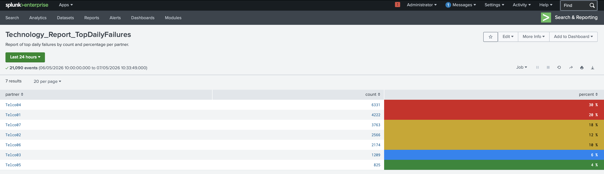
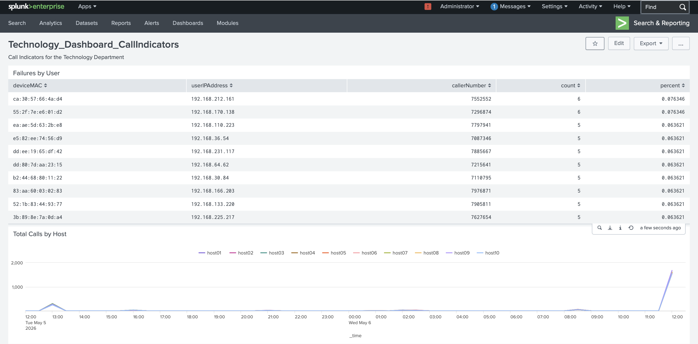
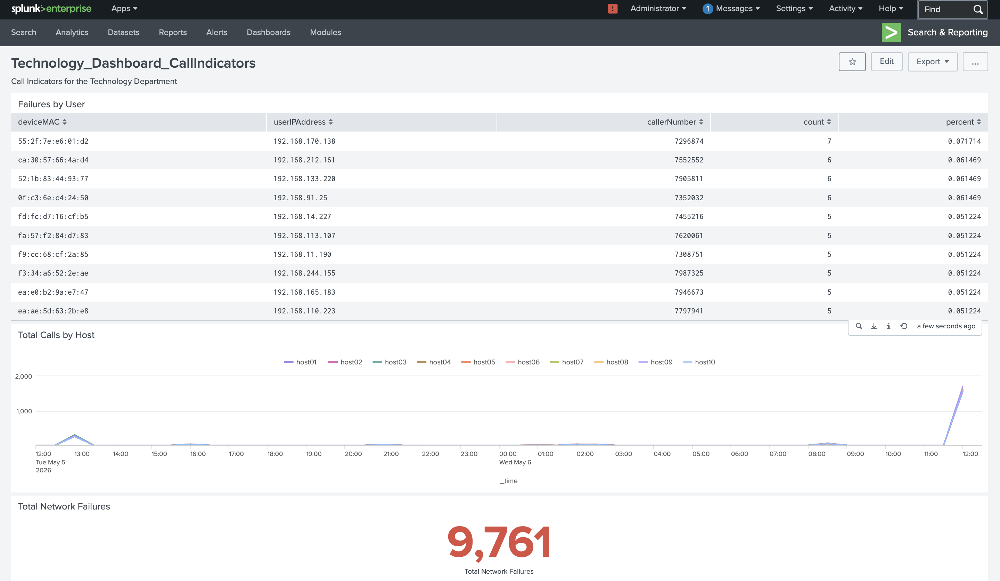
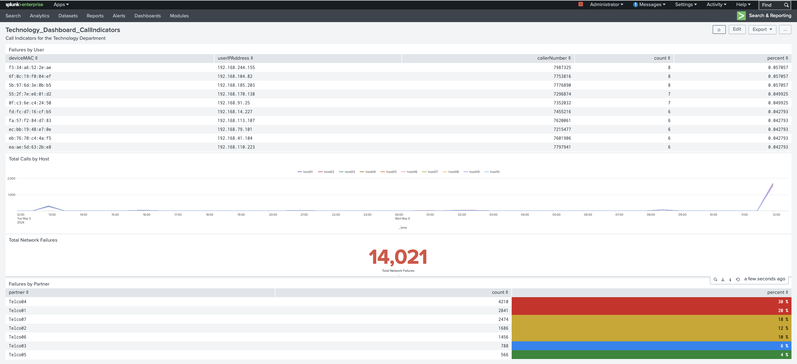
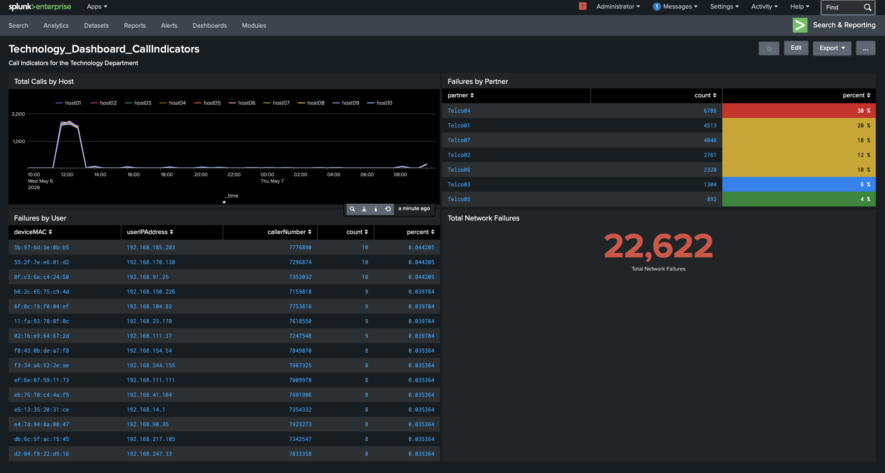

</> Markdown

# Splunk Operational Monitoring Dashboard

## Overview
This project showcases the development of a multi-panel Splunk operational monitoring dashboard designed to analyze network failures, monitor host activity trends, visualize operational metrics, and centralized failure reporting using SPL queries and interactive visualization. 

The dashboard intergrates statistical reporting, time-series analysis, KPI monitoring, and partner-based failure analytics into a unified monitoring interface.

---

# Key Features
- Multi-panel operational monitoring dashboard 
- Network failure analytics and reporting
- Time-series host activity visualization
- KPI-based total network failure tracking
- Partner-based failure distribution analysis
- Statistical event aggregation
- Dashboard layout optimization
- Dark-mode dashboard customization
- Interactive Splunk visualization

---

# Technologies Used 
- Splunk Enterprise
- SPL (Search Processing Language)
- Splunk Dashboard Studio
- Statistical Analysis
- Time-Series Visualization
- SIEM Monitoring
- Operation Monitoring
- Data Visualization

---

# Dashboard Development Progress

## 1. Top Daily Failure Analysis
Statistical reporting dashboard displaying top daily network failures by partner, including event counts and percentage-based failure distribution analysis.

---

## 2. Call Indicator Failure Monitor 
Single-panel monitoring dashboard displaying failure events by device MAC address, IP address, caller number, and event frequency metrics.

---

## 3. Dual-panel Network Monitoring Dashboard
Dual-panel Splunk dashboard integrating statistical failure analysis with time-series visualization to monitor host activity and network event trends. 

---

## 4. Integrated Network Monitoring Dashboard
Integrated monitoring dashboard combining failure analytic, host activity trend visualization, and total network failure metrics into a centralized operational view. 

---

## 5. Complete Operational Monitoring Dashboard 
Comprehensive Splunk operational monitoring dashboard integrating user failure analyisis, partner-based reporting, time-series host monitoring, and centralized network failure metrics. 

---

## 6. Optimized Dark-Mode Monitoring Dashboard 
Optimized dark-mode Splunk dashboard featuring enhanced panel organization, centralized monitoring metrics, partner failure analysis, and time-series host activity visualization.

</> Markdown

---

# Example SPL Queries

## Time-Series Host Monitoring
'''spl
index=network
| timechart count by host
'''

## Total Network Failures
'''spl
index=network action=failure
| stats count
'''

## Partner Failure Analysis
'''spl
index=network
| stats count by partner
| eventstats sum(count) as total
| eval percent=round((count/total)*100,2)
| sort - count
'''

## User Failure Analytics
'''spl
index=network
| stats count by deviceMAC userIPAddress callerNumber
| sort - count 
'''

---

# Key Insights
- Centralized operational monitoring data into unified dashboard interface
- Visualized network failure trends using time-series analytics
- Aggregated event data for statistical monitoring and reporting
- Implemented KPI-style monitoring using single-value metric
- Improved dashboard usability through panel organization and dark-mode optimization
- Developed comparative failure analysis across hosts and partner systems

---

# Project Purpose 
This project was created to strengthen practical SIEM monitoring, SPL querying, dashboard visualization, and operational analytics skills using Splunk Enterprise while developing hands-on experience with monitoring and reporting workflow.

---

# Repository Structure
'''text
splunk-operational-monitoring-dashboard/
|
|-- README.md
|
|-- screenshots/
|   |--01-top-daily-failure-analysis.png
|   |--02-call-indicator-failure-monitor.png
|   |--03-dual-panel-network-monitoring-dashboard.png
|   |--04-integrated-network-monitoring-dashboard.png
|   |--05-complete-operational-monitoring-dashboard.png
|   |__06-optimized-darkmode-monitoring-dashboard.png
|
|-- queries/
|   |-- partner_failure_analysis.spl
|   |-- host_monitoring.spl
|   |-- user_failure_analytics.spl
|   |__ total_network_failures.spl
|
|__ dashboard-config/
   |__ dashboard.xml
'''

---

# Author 
Developed as part of a hands-on Splunk operational monitoring and SIEM dashboard project focused on network failure analytics, visualization, and centralized monitoring workflow.
